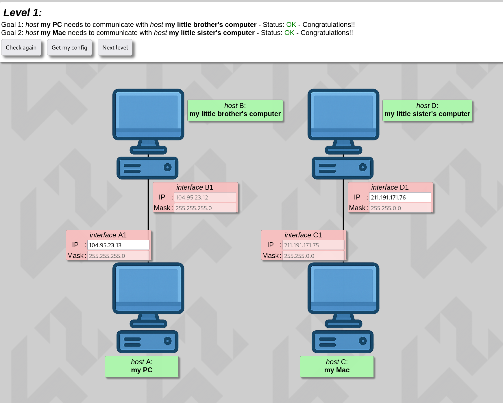
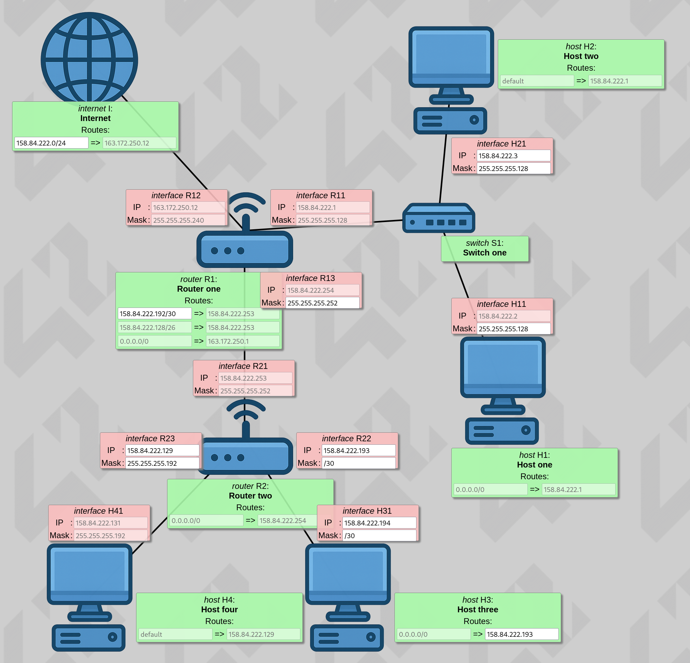
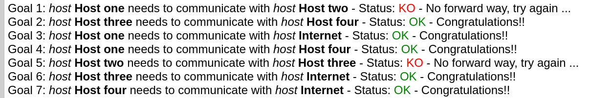
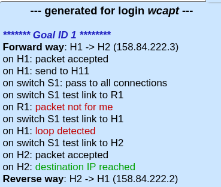
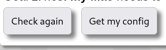
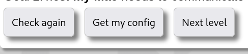

# 42 NetPractice
*This project has been created as part of the 42 curriculum by wcapt*

## Overview
### Description

NetPractice is a hands-on networking training tool designed to help learners master fundamental networking concepts through interactive configuration challenges. The project simulates real-world network environments where users configure routers, switches, IP addresses, subnet masks, gateways, and routing rules across multiple levels of increasing complexity.

### Goal

The goal is to reinforce understanding of core networking principles — including TCP/IP addressing, OSI model layers, subnetting, routing, and device configuration — by applying them in practical, scenario-based exercises.

### Installation

1. Download the folder on intra42.
```
net_practice.1.9.tgz
```
2. Navigate to the project directory to find a file `.sh`
```
run.sh
```
3. Run it. This launches the interactive environment to start the exercice.
```
Enter your 42_login
```
4. Start !!!
```
Now you can start to complet the 10 levels of the NetPractice project.
```

### How it works ?

There are 10 training levels available. Below is an example of how each level works:

For every level, a non-functional network diagram is displayed.




At the top of your screen, you’ll see one or more objectives that you must complete by adjusting the available network settings — such as IP addresses, subnet masks, gateways, or routing rules — until the network operates correctly.




You can use two main buttons during each level:

    [Check again] — to validate whether your current configuration meets the objectives.
    [Get my config] — to download your configuration file at any time. You will need this file for submission.




Once you successfully complete a level, a new button will appear. Click it to advance to the next level.



## ⚠️ Important

Before proceeding to the next level, always export your configuration using the [Get my config] button. Save the file and include it in your Git repository — you must submit 10 configuration files, one per level, at the root of your repo.


## References
- [gitbook.io](https://42-cursus.gitbook.io/guide/4-rank-04/minirt) - Official MiniRT project guide in the 42 curriculum
- [medium.com](https://medium.com/@iremoztimur/building-a-minirt-42-project-part-1-ae7a00aebdb9) - Detailed tutorial on building a ray tracer from scratch
- [scratchapixel.com](https://www.scratchapixel.com/) - Ray tracing fundamentals explained step by step
- [raytracing.github.io](https://raytracing.github.io/) - Free book “Ray Tracing in One Weekend”, perfect for getting started
- [github.com](https://github.com/) - Open-source MiniRT implementation with helpful comments
- [42born2code.slack.com](https://42born2code.slack.com/) - Discussions and tips about MiniRT within the 42 community (access required)